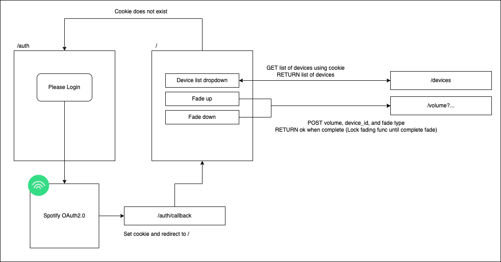
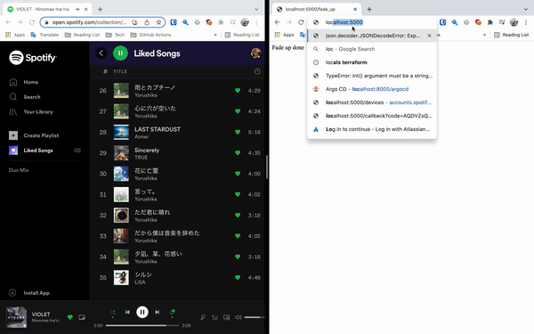

# Introduction
During a stream I was listening to, I was notified that there was an problem where current StreamDecks plugins do not have the features of fading in Spotify volumes.  

After looking more into it, it would seem like fading volumes was not the only features missing and the development space looks promising.  

Seeing this space and I've also been eager to try out Python and learning more about OAuth 2.0, I thought this was a good chance to play around.

# Scrum
## Volume fading
### User story
- As a user, I would want to fade the volume of my spotify device.
- As a user, I would want to be able to select which spotify device is available for me to fade.
### Done condition
- User is able to login to their account
- User is able to get their active device
- User is able to fade volume up for a specific device
- User is albe to fade volume down for a specific device

# API Endpoints
|Method|Endpoints|Description|
|-|-|-|
|GET|/|Root page which links to other functions (Fading only for now)|
|GET|/auth|Redirect to spotify Oauth2.0 workflow if login cookie not found or cookie expired.|
|GET|/auth/callback|Callback endpoint for spotify API OAuth2.0|
|GET|/devices|List of spotify devices that are available for manipulation|
|GET|/version|Description information of the app|
|GET|/volume|Information of volume|
|POST|/volume|Fade up or down the volume of a specific device|

# Architecture

# Goal
The goal of this API is to allow automations for Spotify.  
Below automations are split into 2 parts, the UI and Functionality part.

## UI
- Easy way to login and refresh tokens 
    - Usual streams are 3 hours, since access token expires in an hour, using refresh will give a better UX
- Easy way to access the features.
    - The current PoC requires you to input the actual URL paths, which is very inconvenient for streamers.  
    A button or proper frontend will make the UX better.
- Integrate with StreamDeck plugins (Beta)
    - Most streamers use StreamDeck as their main stream event controller. A plugin integrated into StreamDeck will be a familiar experience for streamers

## Functionality
- Volume fading (fade in and fade out)

# PROBLEMS need solving before alpha
- Many user specific variables are handled as global variable (volume and device id for example). This ain't gonna work if more than one person uses this. Therefore use cookies or pass cur vol into the path itself.
- Using post instead of using a get function as we should follow REST concepts as much as possible
